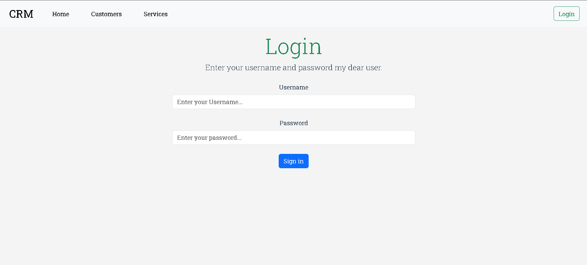
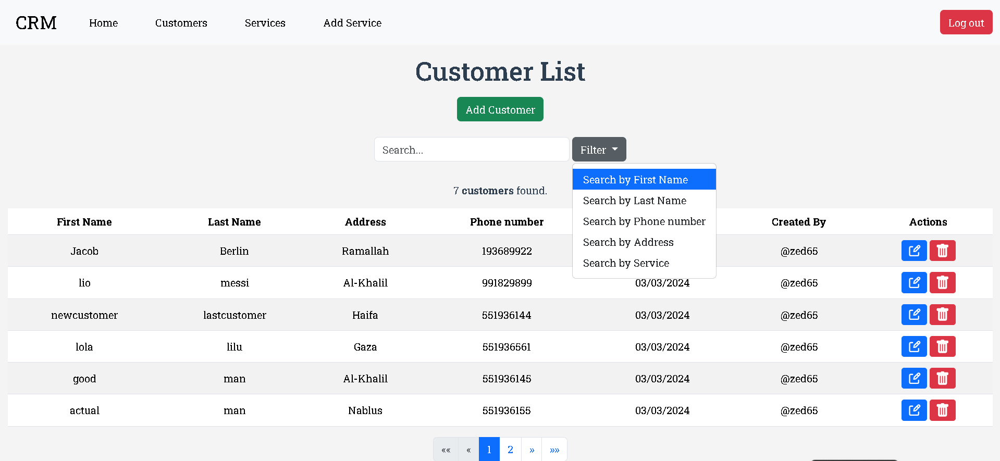
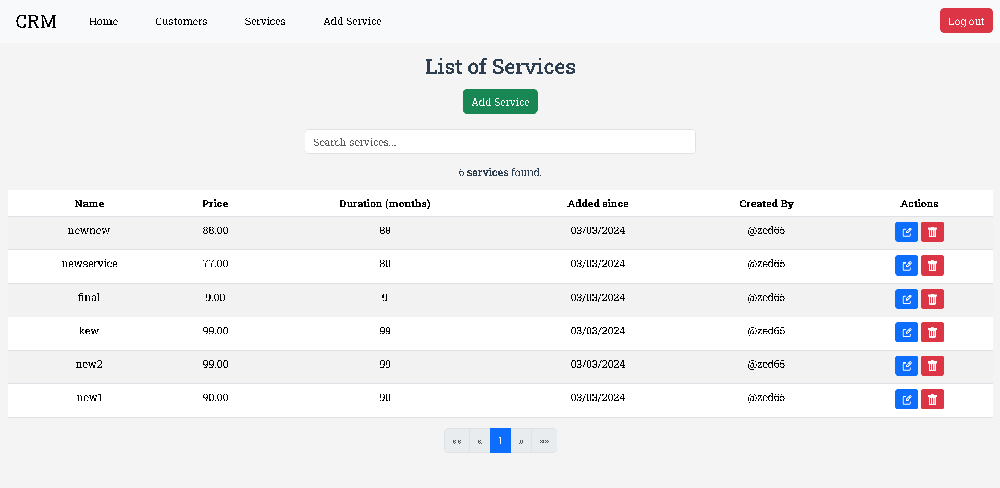
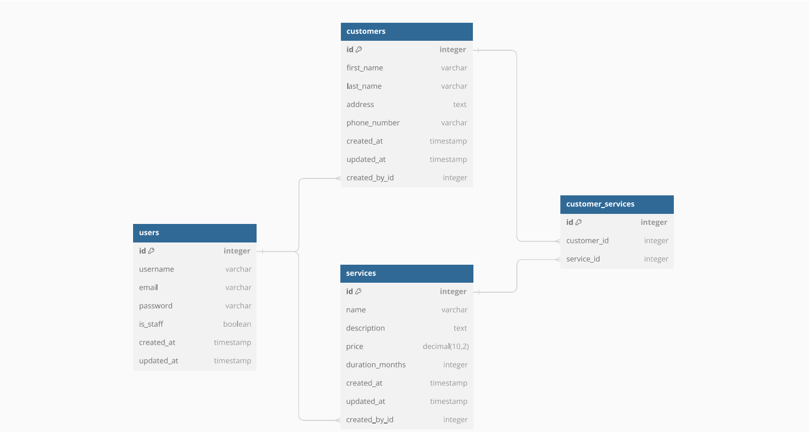

## App Details

Simple CRM application where employees can:
- Log in to the system
- Search and list customers
- Search and list services
- Manage (Add, Edit, Delete) customers
- Delete/Add services to the customers
- Allow Admins to Manage (Add/Edit/Delete) services

## Project Details

- Python 3.7.0
- Django 3.2.24
- MySQL 5.7.44
- Vue 3.4.21
- Vue/CLI 5.0.8
- Bootstrap 5.3.3
- axios 1.6.7

## Project Screenshots





## Database Relations



## Vue Project Setup
```bash
#cd into the directory
cd client
```

## Prerequisites

- Node.js (v18.16.1)
- Vue CLI (v5.0.8)

## Setup and compiles for development
```bash
# Install dependencies
npm install
# Run the development server
npm run serve
```

## Django Project Setup

This guide provides step-by-step instructions to set up a Django project with Django REST framework and MySQL.

## Prerequisites

- Python (>=3.7)
- MySQL database server

## Setup
```bash
#First cd into the directory
cd server
```

1. Set up a virtual environment
```bash
python -m venv venv
# For Windows
venv/Scripts/activate
# For Linux
venv/bin/activate
```

3. Install Dependencies
```bash
pip install -r requirements.txt
# Special step for windows (for mysqlclient error mitigation)
pip install mysqlclient-1.4.6-cp37-cp37m-win_amd64.whl
# Otherwise
pip install mysqlclient
```

4. Create a MySQL Database
```sql
CREATE DATABASE your_database_name;
```

5. Configure Database Settings

Update your database configuration. Create a `.env` file using `.env.example` as an example to fill in the details.

6. Apply Migrations
```bash
python manage.py makemigrations
python manage.py migrate
```

7. Create Superuser (Optional)
```bash
python manage.py createsuperuser
```

8. Run the Development Server
```bash
python manage.py runserver
```

### Additional Configuration

Adjust other settings in `crm/settings.py` as needed.

## Contribution

Feel free to contribute to this project. Submit a pull request or open an issue if you have any suggestions or improvements.